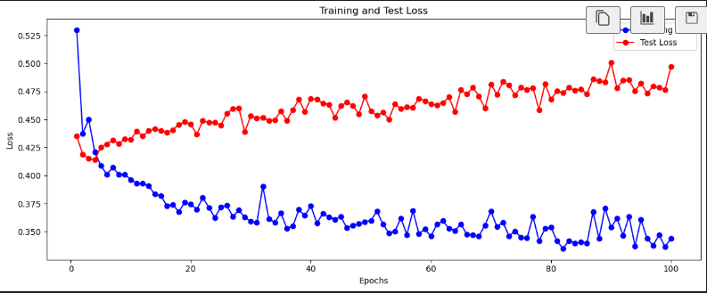

AI Essential 과정
===

강사 : 이우엽

## 수업 자료 채널
자료: https://mm.jaen.kr/ai-essential-67/channels/off-topic

https://mm.jaen.kr
아이디 : essential67
비밀번호 : welcome1!

## Daily Queez
https://manage.jaen.kr
아이디 : 이름
패스워드 : welcome1!

## Colab 링크

### Day 1
원본: https://colab.research.google.com/drive/1_e-kZADHCXFGcDnuoZTJ7ow5gOd54IYH?usp=sharing#scrollTo=1edf01db
사본: https://colab.research.google.com/drive/1q-B58ccSUkFZYA065bz-f7zY6IRiT28i#scrollTo=c06ec169

(Day 1)
# Python
## import 
- import를 사용할 경우 바로 밑에 있는 것만 붙을 수 있음 
- 맨 밑에 까지 연결이 안될 수 있다.

## from mymodule import welcome 
- 맨 밑에 까지 연결이 된다.

## Python의 인덱싱
- 양수 인덱싱 (왼쪽 부터 시작하는 인덱싱)
- 음수 인덱싱 (오른쪽 부터 시작하는 인덱싱)

tensor_2d[0, :] = 100' 를 쓰는 것과 ;tensor_2d[0][:] = 100 의 차이
- 뒤에 것은 쓰지 않는 것이 좋다.
- intemediate 처리하는 과정에서 copy가 발생할 수 있다. 

## Tensor Flow/Pytorch
- Tensor Flow
  - 정적 그래프 (성능이 조금 더 좋음)
  - 지금은 거의 사용하지 않는다.
  - 사용자가 최적화에 대한 고민을 좀 덜한다. (저점이 높다.)
    - 다중화/Multi Core등에 대해서는 고민을 좀 덜한다.
- Pytorch
  - 동적 그래프 (사용성이 더 좋다)

 
# Pytorch

## (시험 나온다) Tensor (p17 ~ 26): 실기와 필기가 모두 나온다

- 다차원의 배열(행렬)
- Pytorch Tensor는
  - 자동 미분을 지원한다.
  - GPU(CUDA)를 지원하여 연산을 가속할 수 있다. (장치를 쉽게 이동힐 수 있다.)

## (시험 나온다) Shape을 조정하거나, 최대값을 찾거나 (연습문제 02-001 ~ 02-004)

# 인공지능

## 개요

### 목표: 인간처럼 생각하고 학습하고 문제를 해결
- 분석
- 학습
- 추론 (예측, CoT)

### 분류
- ANI: 좁은 인공지능 
- AGI: General AI
- ASI: 초지능 (사람을 초월하는 인간의 능력)

### 모델의 선택
- 통계적 기법 (정형 데이터)
- 알고리즘 기반 (정형 데이터)
- 신경만 기반 (비 정형 데이터)

##  머신러닝

- 명시적인 프로그래밍 없음, 입력을 토대로 출력을 만들기 위한 규칙을 찾아 내는 것

- 모델: 입력 데이터를 바탕으로 예측이나 결정을 내리는 학습의 결과물 (선형회귀, 의사결정 트리, 신경망 등 다양한 알고리즘을 통해 규칙을 학습)
  - 판별 모델(Discriminative Models): 주어진 입력 데이터를 기반으로 목표 변수를 직접 예측
    - Classification
  - 생성 모델(Generative Models): 주어진 입력 데이터를 통해 분포를 학습하여, 새 데이터를 생성
- 프로그래밍과 머신러닝의 차이
   - 생성과정
    - 프로그래밍: 프로그래머가 입력과 출력을 분석하여 로직을 설계 (주어진 입력과 출력이 적어도 Rule을 만들 수 있다.)
      - 경우의 수가 많아 지면, 만들기 어렵다.
    - 머신러닝:
	    - ... 
  - Task
    - 프로그래밍: 상대적으로 정형화된 문제
	- 머신러닝: 상대적으로 정형화되지 않은 문제
  
- 학습 
  - W, b를 찾는다 (y`이 실제 값 y에 가까워 지도록), 과적합이 발생할 수 있다.
    - 표현력도 좋고
    - 일반화도 잘되는

- 머신 러닝의 학습 절차 (시험에 나온다.)
  - 문제 정의 : 문제 정의
  - 데이터 수집
  - 데이터 전처리
    - 분석 과정의 전처리: 특징을 추출하기 위한 목적, 독립 변수의 통폐합 
	- 학습을 하기위한 전처리: 인코딩 등(ex, 문자열-> 숫자열, 값의 Scaling 적용)
  - 모델 선택 
  - 모델 학습
  - 모델 평가
    - 표현력: 학습 데이터로 평가한다.(학습 데이터를 잘 반영한 것)
	- 일반화: 테스트 데이터와의 차이로 평가한다.
	  - 모집단의 내용이 잘 반영. 학습되지 않는 데이터에 대한 결과도 잘 내야 함
  - 모델 개선
    - 하이퍼파라미터 튜닝
	- 데이터 확장
	- 알고리즘 변경
  - 예측 및 적용

- 좋은 머신 러닝 모델 
  - 성능 (일반화)
  - 예측도
  - 복잡도 (데이터의 복잡도에 맞는 적절한 복잡성) 
    - 정확한 계산은 불가하지만, 그러나 LLM에서는 사용함, 단어 개수 등 
 

- 머신 러닝 학습 유형 (시험에 나온다)
  - 지도학습 (Supervised Learning)
    - 정답(y, 레이블)이 있는 데이터를 이용하여 학습
	- 모델은 주어진 입력(Features)에 대한 출력(y`)을 예측 
	- 지도하는 과정: 정답과 출력의 차이를 줄이는 방향으로 지도하는 과정이 있어야 함
	- Regression, Classification
	
  - 비지도 학습 (Unsupervised Learning)
    - 지도하는 과정이 없음 
	  - 레이블이 없을 떄
	  - 레이블이 필요 없을 때
	- 차원 축소
	  - 특징 추출 (레이블을 안쓴다.)
	    - Interaction: 상호 작용
		- 데이터 시각화
	  - 지도 학습의 전처리 용도로 활용한다.
	- 군집화
	  - 레이블이 없는 경우
	  - 고객 세분화
	  
  - 자가 지도 학습 (Self Supervised Learning)
    - 지도학습 임 (자기 자신을 복원하거나..)
	- Auto Encoder, Transformer

- 주요 용어
 - 데이터 셋
   - 훈련(Training) 데이터 셋과 평가(Test) 데이터 셋은 교집합이 없어야 한다.(Hold Out)
     - 평가 데이터 넷은 훈련 데이터 넷에 누설 되면 안된다.
 - Features
 - Label
 - True Value (Label)
 - 예측 값 (Predicted Value)
 - 실제 값과 예측 값의 관계
   - 회귀: 손실, 오차/잔차
   - 분류: 손실 (Cross Entropy에서는 오차/잔차라는 말을 쓰지 않는다)

## 딥러닝
- 비정형 데이터 문제를 해결하는데 특화됨
  - 전통적인 머신 러닝과 비교해서
    - 특징 추출 과정에서 발생 할 수 있는 Feature 로스가 발생하지 않아 성능이 좋다.
	

# DNN(Deep Neural Network)
## 심층 신경망 (시험에 나온다.)
  - Fully Connected Network(FCN), Feed Forward Network(FFN) 이라고도 불리운다
  - 입력층 (Input Layer)
    - 실존하지는 않고, 개념적으로 만 있다. (Keras에서는 있도록 권장한다)
  - 은닉층 (Hiddle Layer)
    - 10년 전만 해도 10 ~ 20개 층이었다.  
	- 특징을 추출한다.
	- Perceptron으로 구성되어 있다.
	- hidden layer들 간에 Fully Connected 되어 있어서 FC Layer라고도 한다.
  - 출력층 (Output Layer)
	- Perceptron으로 구성되어 있다.

## 각 Layer 
  - Perceptron
  - Neuron 이라 불리는 계산 단위: 가중치(Weight) 화 편향 (Bias) 이라는 파라미터를 사용하여 데이터를 처리함   

## 심층 신경망 학습 과정 
### 학습 단계 개요
- 순전파
- 손실계산
- 역전파(미분)
  - 제프리 힌튼이 개발했다.
- 최적화 
  - 경사 하강법

### 순전파(Feed Forward Propagation)
- 예측값을 생성하는 것
- 사용처
  - 학습
  - 평가
  - 추론    
  - 가중치
  - 편향
  - 활성화
  - 다각화 
  - 하이퍼 파라미터
  - 뉴런 개수
  - 계층 수

### 손실 계산 (시험에 나옴)
- 손실 값이 최소화 되도록 Loss Function(손실함수/목적 함수)을 사용해서 계산
  - 차이의 제곲의 합이 최소화 되도록 
- 회귀에서 사용 가능한 손실 함수 
  - 연속 값 (실제와 예측값을 차분으로 계산 가능할 때)
  - MSE (Mean Square Error) : 오차의 절대값이 클 수록 큰 페널티
    - 차분이 지수적으로 증가함. 크게 튀는 오차를 줄이게 됨. 작은 오차는 커짐. 중간에서 만남.
  - 오차의 편차는 줄어듬. Outlier
  - MAE (Mean Absolute Error)
    - 큰 오차도 줄고, 작은 오차도 줄어듬
  - 오차의 편차가 크지 않지만, 가끔씩 튀는 것들이 나옴 
  - 오차/잔차
    - 오차: 예측값을 만드는 데이터가 모집단인 경우
      - 잔차: 예측값을 만드는 데이터가 표본인 경우

- 분류에서 사용하는 손실 함수 
  - 분류의 출력은 확률로 표현할 수 있음

  - 확률 분포 간의 차이를 계산하는 방법

  - Cross Entropy 
      - 다중 클래스 분류 문제 (선택할 수 있는 레이블의 개수가 여러 개임)
  
  - Binary Cross Entropy
    - 이진 분류 문제 분석에 사용

### 역전파
- 경사하강법 (Gradient Descent)
  - 이 작업을 수행하면 미분 값이 작아진다.
  - W, b를 조정한다. (Otimizer)
- Loss에 대한 미분 값을 반영하는게 경사 하강법 임
  - 출력층으로 부터 입력층 방향으로 미분 + Chain Rule을 적용하여 미분을 계산하는 방법
  - 미분 값을 재사용함

- 경사 하강법을 쓰기 위한 것임

### 활성화 함수 (시험에 나옴)
- 선형 결합 결과 (가중치 곱의 합)을 비선형 결과로 변환 
    - 출력층의 활성화 함수
    - 출력층의 형태로 변환하기 위한 것
    - 쓸수도 있고 쓰지 않을 수도 있음
  - 은닉층의 활성화 함수
    - 모델에 비 선형성을 준다.(가중합을 비선형 변환)
- Sigmoid 
  - 입력 값을 0~1사이로 압축 
  - 기울기 소실 (Gradient Vanishing)
    - 은닉층에 sigmoid를 쓰면 미분 값이 매우 작아 지는 효과가 있어서 잘 쓰지 않는다.
    - 미분 값이 너무 작아져서 학습이 안된다.
    - Sigmoid의 미분은 0 ~ 0.25가 된다.

- Tanh
  - 입력 값이 범위가 -1 ~ 1
  - 미분 값의 범위가 0 ~ 1
    - Gradient Vanishing이 완화된다.

- ReLu (Reflected LU)
  - 음수면 0, 양수면 그 값을 그대로 쓴다. 
  - 미분 값은 0, 1
    - 활성화 함수에 의한 기울기 소실 문제가 없다.
  - 1이 나오면 좋음
  - 0은 가끔씩 나오는 경우에 사용 가능. 계속 0이 나오면 학습이 안됨
    - Dying ReLU (입력 결과와 무관하게 항상 0이 나오면 학습이 진행되지 않음)
    
  - 미분 불가지점(0)이 있다. 좌미분을 해서 0으로 처리    
  - 연산량이 적다.
  
- Leaky ReLu
  - 음수 인 경에에 0보다 살짝 큰 값을 줌.
- 출력 값이 양수 이면 쓰기 좋고, 음수가 많이 나오면 미분 값이 아주 작아서 학습이 잘안된다.
- 양수 값이 많다면 ReLU의 훌륭한 대체제이다.
- 연산량이 적다.

- ELU
  - 음수가 완만하게 줄어든다.
- 연산량이 많다. (Exponential 연산)

- 활성화 함수 고르기
  - Gradient Vanishing이 발생하는지.
- 출력 데이터가 양수가 많은지, 음수가 많은지에 따라서 고름 
- 재학습이 용이한지 여부 
- 처음 하는 사람은 ReLU나 Leakt ReLU를 쓰면 됨.

	
### 자동화 미분 (시험에 나온다)
  - 각 Training Step 마다, 미분을 하는 데 미분 값을 누적하지 않고 초기화 한다.
    - Fine Tuning 등을 하는 경우, 초기화 하지 않고 iteration을 한 후 평균 값을 반영하는 경우에 사용한다.

### 경사 하강법 유형 (시험에 나온다)
- 1 Epoch
  - 전체 N개 데이터 모두에 대해서 w, b update 하는것

- 학습하는 데이터의 크기에 따른 분류

  - 배치 최적화 도구/배치 경사 하강법(Batch Gradient Descent)
    - 전체 N개 데이터를 한번에 넣어서 손실을 평균 내고 w, b를 '한번' 업데이트 하는 것.  손실이 1개이다.
    - 안정적이다 (왔다 갔다 널뛰지 않고 조금씩 내려 온다)
      - 불안정적: 기울기 0을 기준으로 왔다 갔다 널뛰는 것
    - 정확하다. (학습 데이터에 대해 과적합된다는 의미, 좋지 않다)
    - 한번에 메모리 요구사항도 커서 비효율 적이다.
    - 여러 epoch을 돌려줘야 한다.

  - 확률적 경사 하강법 (Stochastic Gradient Descent, SGD)
    - 학습 데이터에서 랜덤 샘플링(확률) 하고, 매 반복마다 한개의 데이터 포인트를 사용하여 기울기로 계산
    - N개의 데이터로 N개의 w, b 업데이트 한다.
      - N개의 업데이트가 되므로, N개 데이터로 학습하는데 부하가 더 큼
    - 계산이 빠르고(1개의 계산만 하므로..), 적은 메모리를 사용한다.
    - 안정적이지 않다. (진동이 발생한다). 수렴이 잘 안된다.
    - epoch을 많이 안돌려도 된다.

  - 미니 배치 경사 하강법 (Mini-batch Gradient Descent)
    - M개 샘플링의 미니 batch로 학습을 하겠다. 각 배치에 대해 w, b를 계산하고 업데이트 한다.
    - 계산 효율성과 안정성을 모두 제공하고, 크기에 따라 성능이 달라질 수 있다.

### Optimizer (최적화 도구) (시험에 나온다)
- Loss를 최소화 하기 위해 W, b 업데이트

- 모멘텀 (Momentum)
  - 기울기의 누적치를 사용하여 진동을 줄이고, 더 빠르게 최적점에 도달
  - 로컬 미니멈을 벗어나서, Global 미니멈 굴러 떨어지게 만들도록 함
  - Nesterov Momentum (Global 미니멈도 굴러 떨어지는 문제를 보완)

- 적응형 학습률 
  - eta (learning rate) 앞에 scale factor를 곱해줌
    - 기울기가 클때는 작게 조정, 기울기가 완만 할 때는 크게 조정(빨리 벗어남)
  - AdaGrad (수식에 오류가 있음. 오래 학습하면 learning rate이 0으로 수렴),
  - RMSprop (AdaGrad 수식 오류) 
  - Adam (RMSprop + Momentum)
    - Variation 들도 있지만 크 성능상의 차이가 있지는 않음

### 데이터 로더 71p ~ 76 (시험에 나온다)
- CustomDataSet 구성 방법

### 반복학습
- 데이터를 점진적으로 학습하는 과정
- epoch: 학습 데이터를 한번에 모두 통과시키는 과정
  - 너무 많은 epoch를 하면 학습 데이터에 과적함 됨

### 심층신경망 구현 - 모델 (p84)
- 출력층의 손힐 함수, 활성화 함수, 출력 뉴런 개수를 어떻게 구성하는지
- 회귀
  - Loss Function: MSE/MAE (차로 계산할 수 있는 Loss Function)
  - 출력층 활성화 함수: 안씀
- 이진 분류
  - Loss Function: BCE (nn.BCELoss)
  - 출력층 활성화 함수: Sigmoid 등
- 다중 분류
  - Loss Function: Cross Entropy
  - 출력층 활성화 함수: 없음(내부적으로 Softmax)
    - Softmax를 사용하나, PyTorch에서는 nn.CrossEntropyLoss()가 내부적으로 Log Softmax를 사용하고 있음 (계산 안정성의 장점이 있음

### DNN 성능 향상 방법
- 학습 결과의 분석

  - Training Data Loss와 Test Data Loss의 차이가 나는 경우 --> 일반화가 잘 안되어 있는 것임. (과대적합/Overfitting이 되었음) - Training data의 성능만 계속 좋아짐
  - Data가 충분하지 않은 경우에 발생한다.
    - 그러나 Training Data를 늘리는 것은 맨 나중에 하는 일이고
    - 교차 검증 / Data Validation
      - K Fold 
        - Test Data와 Training Data를 섞어서 K개 Fold로 나누어서 데이터의 표준 편차 등을 검사 
        - 성능이 많이 떨어지는 Fold가 있는지 검사해 봄

  - '하이퍼 파라미터 튜팅'을 한다.

- 과대적합
  - Bias : 중심에서 얼마나 많이 벗어나 있는가 ?
    - Bias가 크년 Underfitting임 (Training Data와 Test Data도 잘 반영되지 않았음)
  - Variance
    - 탄착군이 몰려 있지 않은 것

  - 학습이 잘 된것 : Low Bias + Low Variance
  - Overfit : Low Bias + High Variance
  - Underfit : Hig Bias + Low Variance, High Bias + Low Variance

- 과대 적합 완화 방안
  - 데이터를 더 많이  수집한다.
  - Drop Out 
    - 학습 중에 신경만의 일부 뉴런을 부작위로 꺼서, 신경망이 특정 뉴런이나 경로에 과도하게 의존하는 것을 방지
    - 학습: Drop Out 비율 만큼 0으로 설정
    - 추론: 0으로 설정하지 않고, Sclale 한다....
    - model.train(), model.eval() 에 의해 구분 된다.
  - Regularization (정칙화)
    - W의 절대 값의 크기를 작게 유지(제어) 한다.
      - 절대 값이 커지면 모델의 표현력이 좋아진다.
      - 절대 값이 작아지면 모델의 표현력이 낮아진다.
      - W가 커치면 손실이 커지는 상황이 발생할 수 있다.
      - 손실함수에 Penaty를 추가 하는 방식으로 적용한다.
      - PyTorch에서는 정칙화를 구현하지 않고, Weight Decay W = W0 - eta(미분) 하는 방법을 사용함 
      - SGD에서 Wegith Decaly를 적용하는 방법은 다음과 같음
        - optimizer = optim.SGD(model.parameters(), lr=0.01, momentum=0.9, weight_decay=0.01)
   - L1/L2 정칙화를 적용하면 모델의 목적을 수정하여 모델이 학습 데이터 손실에 집중하는 것을 방해 (?)
  - Early Stopping: Epoch 제어 (과대적합이 시작되기 전에 학습을 중지)
    - Epoch를 크게 줘도 성능이 나빠질것 같으면, 자동으로 동작 시킴. 모델 Check Pointing을 같이 씀
    - Check Pointing : 모델 성능이 잘 나올 떄, 모델 파라미터를 저장시킴. 

  - Batch Normalization (정규화)
    - Feature Scaling (Data 전처리 작업에서 사용한다.)
      - Scaling이 다른 Feature들의 Scale을 맞춘다.
      - 수렵의 속도 상승을 위해 개발되었다.
    - Batch Normalization은 전처리가 아니라 각 FC에 적용하는 것이다.
      - 표준화를 하면 절대적인 크기는 줄고, 상대적인 크기는 유지된다.
      - 정규분포(평균이 0이고 표준 편차가 1이된다.) Out Lier를 짤라져서 Overfitting 완화가 된다.
      - 미니 배치에서 평균과 분산을 계산한다.
        - 값을 누적해 놓았다가, 추론할 때 적용한다. (train과 Eval의 동작이 다르다)
      - Linear와 Activation 함수 사이에 넣는 것이 성능이 가장 좋다.

  - Ensemble - 모델을 여러개 만들고, 모델의 편향을 줄임
    - 자원을 많이 먹음 (대부분의 모델에서 성능 향상됨)
    - Mixture of Expert in LLM 도 Ensemble에 적용되는 방법임 

# CNN
- 2D Data: DNN에서 했던 데이터는 순서/위치가 없는(순서가 바뀌어도 상관 없음) 2d 독립 변수
- 4D Data: 그림 이미지: 3차원의 의미가 있음. 순서가 중요함.
  - 4D Data를 2D Data로 바꿔서(평탄화) 할 수 있다. (Location 정보가 소실 된다)
  - 2D로 바뀌어도 이미지의 특질을 어떻게 유지할 수 있을까 ? (이미지를 가공/특징을 추출 한다) --> CNN
- 특징 추출 부 + DNN 으로 구성된다.
- CNN의 은닉층: 비선형 활성화 함수가 붙는 부분을 CNN 은닉층이라 한다.

## 합성곱 신경망/Convolutional Neural Network(CNN) (시험에 나온다)
- DNN이 풀지 못하는 4차원 데이터(이미지 데이터) 문제를 푸는데 특화된 딥러닝 모델 
- 합성곱 층, 풀링 층,FC 층으로 구성된다.
  - Feature 추출 : 합성곱 층 + 풀링 층
  - 의사 결정 : FC 층

### 합성곱 층
- ch, h, w 등의 특징을 추출하는 계층
- 필터를 슬라이딩 입력 처리하여 특징 맵(Feature Map)을 만든다.
  - 데이터의 공간적 구조를 유지하며, 유의미한 패턴(가장자리, 질감)을 학습
  - 필터(또는 커널)는 작은 크기 행렬로 구성
  - Receptive Field: 특징을 추출하는 필드. 필터를 적용하여 곱하고, 더한다 (합성 곱)

  - 필터 자체가 학습을 통해서 완성된다. (필터가 학습된다)
    - 기존에 알려져 있는 미분 필터나, 블러링 필터가 아닐까 추정하지만 완전한 해석은 되지 않는다.
    - 3x3 커널은 9개의 W를 갖는다.    

  - 특징 맵의 크기는 원본 이미지 보다 작아진다.
- 패딩 (짜투리 공간에 0을 채운다)
- 스트라이드 (스트라이드에 따라 연산이 안되는 영역이 생길 수 도있다)
- channel
  - 이미지가 R/G/B로 표현된다고 한다면, R/G/B 각각이 하나의 channel이된다.

- 특징 맵 크기 계산
  - 28, 28이미지 3X3 필터 적용
  
  - K: 3, P: 0, S: 1을 많이 쓴다.

### 풀링 층(시험에 나온다)
 
- 특징 맵의 공간적 크기를 줄여 준다. (계산 복잡도 감소, 과적합 방지) 
  - Overfitting을 완화하는 역할도 중요하다.
- 필터를 만들어서 최대 값(Max Pooling)을 뽑거나, 아니면 평균(Average Pooling)을 적용한다. (자료 114 Page 참고). 현재는 Max Pooling 만 사용한다.

### FC (완전 연결 층)

- 모델
Conv > ReLU > Conv > ReLU > Max Pooling > Cov > ReLu > Pool
--(4D)--> FLAT --(2D)--> Linear > ReLu > Linear > Softmax  

### CNN Pytorch 
(시험에 나온다. Model 구현)
#### nn.Conv2d
- 2d: h, w + ch
- parameter
  - in_channels: 입력 이미지 채널 수 (흑백:1, RGB: 3)
  - out_channels: feature map의 수
  - kernel_size: 커널 크기 (3x3을 중첩해서 많이 씀) 2014년 논문
  - stride: 1 (2쓰는 경우는 거의 없음)
  - padding: 입력의 가장 자리에 추가되는 패딩 양 

#### MaxPool2d
- parameter
  - kernel_size: 풀링 적용 영역 크기 2
  - stride: 풀링 창이 이동하는 간격
  - padding: 0 (안쓴다)

#### 학습 데이터 셋
- Fashion-MNIST 

## 전이학습(Transfer Learning)과 미세조정
- 전이학습: 이미 학습된 모델을 활용하여 새로운 작업에 적응 시키는 기법
  - Top/Head가 포함되어 있는 계층(FC 계층)을 교체함
  - 대규모 데이터 세트(Image Net)에서 학습된  CNN 모델(VGG, RestNet, Inception)을 활용함
    - 기존 모델의 가중치를 고정(freeze)하고, 새로 학습할 데이터 세트에서 분류 계층만 재학습
    - Conv 계층은 동결하고, FC만 다른 모델로 교체하여 학습
    - 'requires_grad = False'를 활용하여 동결한다.
  - 미세 조정은, 기존 학습 모델의 일부/전체 계층을 고정하지 않고, 로운 데이터에 맞게 재학습
    - Conv 계층의 앞 부분은 고정하고, 일부와 FC만 교체하여 학습

## CNN 동향
### ILSVRC 대회
- AlexNet
  - Drop Out, ReLu 사용이 제안되었음
- VGG Net (2014)
  - 3x3 커널 중첩
  - 계층이 깊이
- RestNet (2015)
  - 계층의 깊이의 한계를 없앰
  - 20~25층의 성능이 한계다 (50층 보다 20층 성능이 더 좋더라..., Vanishing Graident 라고 생각했음)
  - 20층의 출력을 50층으로 바로 전달 해줬더니 성능이 더 좋아짐
  - 잔차(ByPass) : 층간 통신
- Vision Transformers (2020)
  - Nvidia DLSS (샘플링)

## CNN 응용
- 분류
- 분류 + Localization 
  - Bounding Box
- 객체 탐지
- 세그멘테이션
- 초해상도
  - Low Resolution --> High Resolution

## YOLO 실습 (Ultraytics)

## 초해상도 실습

## Stable Diffusion 실습

## 이미지 생성형 AI
### Auto Encoder 
- Encoder: 이미지를 압축해서 Latent Vector로 만듬
- Decoder: Latent Vector로 부터 다시 이미지를 만듬

### VAE(Variational Autoencoder)
- 입력 이미지의 Latent Vector의 분포(평균/분산)를 학습해서, Random Sampling 해서 이미지를 생성
- Diffusion Model의 보조 도구 등으로 사용 중임

### GAN(Generative Adversarial Network)
- Generator(가짜 이미지를 만드는)와 Discriminator(진짜 인지를 판별하는) 간에 경쟁
- Discriminator가 Collapse되면 학습이 안되는 문제가 있음 
- 작은 이미지 밖에 못만듬. Upscaler 등으로 사용 가능 

### Diffusion
- Forward Diffusion
  - Noise를 추가 (평균과 표준 편차)
- Reverse Diffusion
  - Denoise 하면서 어떤 Noise를 뺄지 학습 시킴
- 레이블 
  - Fowarding 단계에서 추가되는  Noise
  - 해당 Noise들은 저장되었다가 Reverse 단계에서 Label로 활용한다.
- Condition
- Diffusion + VAE 
  - Stable Diffusion

- 이미지 생성형 모델 WebUI 설치 (스테이블 디퓨전)
https://github.com/AUTOMATIC1111/stable-diffusion-webui
모델 정보: https://civitai.com/

# RNN
순차적 데이터 - 현재를 이해하기 위해 과거/미래 영향

## 텍스트 데이터 (시험에 나온다)
- 단어와 문장 결합. 비정형 데이터. 문맥이 중요함
- Data Cleansing (데이터 형태) - 텍스트 데이터에서 불필요한 부분(태그, 특수 문자, 공백) 제거
- Data Filtering (의미) - 개인정보/비밀 정보/오염된 정보 등을 제거

## 텍스트 데이터 처리 - 토큰화 (시험에 나온다)
- 텍스트 데이터를 단어/구 등을 최소 단위로 나누는 과정 (토큰 화)
- 토큰
  - Word
  - Subword
- 토큰화 과정 (전처리)
  - 1. Tokenize (Batch Size: 3 - 3개 문장 )
    - A  / Whole / new / World 
    - Heal  / the / World 
    - Under / the / sea
  - 2. 정수화
    - A (1) / Whole (2) / new (3) / World (4)
    - Heal (5) / the (6) / World (4)
    - Under (7) / the (6) / sea (8)
  - 3. Padding (Sequence Len: 4)
    - 1 / 2 / 3 / 4 
    - 5 / 6 / 4 / 0
    - 7 / 6 / 8 / 0
- 토큰 실습
  - https://colab.research.google.com/drive/1PcpZ8LNNtrGiN1eMBYcCYhjk5e2wDXwA?usp=sharing
  - vocab_size: 토큰의 개수
  - unk_token: Unknown_token
  - pad_token: Padding token

### nn.Embedding (시험에 나온다)
- 임의의 정수가 부여된 예제 'A (1) / Whole (2) / new (3) / World (4)' 
  - 정수 ID를 부여했을 뿐인데, 모델은 new가 Whole 보다 크다고 생각한다.
  - Wole이 World 보다 A에 더 가깝다.
- 벡터화
  - 하나의 정수가 아니라, 여러 실수의 조합으로 단어를 표현함 
- 임베딩
  - 학습을 통해 벡터화 하는 것을 임베딩이라고 한다. 각 벡터는 다 파라미터(W)이다. 
  - 임베딩 테이블을 유지한다. Padding + Vocab의 개수 크기 사이즈로 인덱싱됨

## 순환 신경망 개요 (시험에 나온다)
- 순차 데이터 처리하는 NN. 이전 입력에서 학습한 내용을 현재 학습에 반영할 수 있는 구조
  - Feed Forward Network: 은닉층의 출력이 출력층 방향으로만 전달
  - Feed Back Network: 은닉층의 출력이 자기 자신으로 전달 

- 기본 단위 : Cell 
  - Neuron 과 비슷하지만 Recurrent Path를 갖는다.
    - h_t = tanh(W_xh* x_t + W_hh * h_t-1 + b_h)

  - ReLU를 쓰지 않고, tanh를 쓴다.
    - ReLU를 쓰면 Exploring Gradient 문제가 생긴다.
    - Sigmoid를 쓰면 Vanishing Gradient 문제가 생긴다.
    - tanh도 Seqeunce가 길어지면 Vanishing Gradient가 발생한다. 
  - 다음 Step으로 간다.

### Vanilla RNN Cell
- 출력 결과가 직전 계산 결과에 크게 의존함. 
- 장기 의존성 문제
  - 시퀀스 길이가 길어지면 오래된 정보가 뒤로 충분히 전달되지 못한다.
  - Back Propagation을 하면 오래된 W은 잘 업데이트가 되지 않는다.

### LSTM(Long Short Term Memory) (시험에 나온다)
- Long Term: 오래 기억될 정보는 Long Term Memory에 저장하겠다.
- Short Term: 당장 사용될 정보
- LSTM Cell
  - σ : Sigmoid 0 ~ 1 사이의 비율, Gate 역할을 한다. Long Term과 Short Term의 비율을 정한다.
  - f_t : forget gate - h_t-1d에서 들어온 것을 이용해서 Forget 정도를 결정한다.
  - f_t : input gate - h_t-1d에서 들어온 것을 이용해서 Memory 정보를 결정하고, 그 자체를 tanh를 거쳐 전달한다.
 

### RNN의 역전파 과정
- RNN의 역전파는
  - 계산의 반대 방향 뿐만 아니라 
  - BTT(Back Propagation Through Time) - 시간을 거슬러 올라가며 계산을 해줌
 

### 심화구조
- 문제 유형에 따라 Unidirectional 또는 Bidirectional 모델을 선택할 수 있음
  - Unidirectional RNN: 과거 정보만 중요한 경우
  - Bidirectional RNN: 과거 미래 정보가 모두 중요한 경우
- Single Layer/Multi Layer
  - Single Layer:
    - 많이 쓰이지는 않았지만, Feature 가 1개일 경우 Single Layer를 쓰는 경우도 있다.  
  - Multi Layer: 
- Multi Layer 구조
  - One to One
  - One to Many
  - Many to One
    - 실제로는 Many to Many 이지만, 의미 있는 것이 한개라서..
    - 분류/회귀, 감성분류
  - Many to Many (Async)
    - 자기 회귀적 (Auto Regressive) - 출력을 만들어 낼 때, 이전 출력을 자기 입력으로 받음
      - 가장 많이 쓰려고 시도한 구조임
  - Many to Many (Sync)

### RNN 실습
#### 06-021 실행 결과의 분석
06-021 를 실행하면 LSTM의 W은 업데이트 되지만, Embeding은 업데이트가 잘 되지 않는다.
왜냐하면 출력층에 가까운 LSTM 만을 업데이트 하는 것 만으로 Loss가 낮아지기 때문이다.
토큰 임베딩 까지 업데이트 하려면, 모델이 충분히 복잡해야 한다.

### Seq2Seq
- Async Many to Many와 같은 것이다.

### Attention
- Seq2Seq 모델에서 인코더와 디코더 간의 정보 전달을 개선하고, 디코더가 인코더의 모든 출력 정보를 활용 할 수 있게 하는 기법
- Q: Decoder의 Outut
- K: Encoder의 각 Step의 Output
- V: Q * K한 가중 합

- 유사도 score(Q, K) = Q * K_t
- Dot Product Attention
  - Attention (Q, K, V) = softmax(Q * K_t) * V
    -> 값이 커질 수록 Scale이 커지는 문제가 있음
- Scaled Dot Product Attention
  -  Attention (Q, K, V) = softmax(Q * K_t / root(d))
- Multi heade attention
- Self attention
  - 무엇을 학습 하겠다는 것인가 ?
  - W_q, W_k, W_v를 학습한다. Q, K, V로써의 stance가 달라지는 것을 반영한다.

# Transformer
- Encoder
  - 전체 문맥을 보는 강점
- Decoder
  - 생성하는 역할
  - Masked Multi Head Self Attention
    - Cosal Mask를 사용함. (Softmax에 무한 값을 넣으면 0에 가까운 값이 나옴)

- Feed Forward Network
  - Transformer의 출력 층에 붙어 있음.
    - Transformer
  - Wide 구조 (다각화/Diversification)
    - DNN에서 층이 깊어 지는 것과 비슷한 효과
      - 층이 깊어질 수록 Gradient Vanishing 문제가 발생하는데, Wide에서는 이 문제가 상대적으로 덜함
      - Overfitting을 줄이기에도 좋음
    - Google이 발표한 Wide & Deep Learning(2016)에서 사용된 개념.
    - 넓혔다가 줄여주는 행위 
    - 들어간 데이터를 다각화 했다가, 다시 줄이는 방법
      - 내부 구조에서 의미 있는 것을 살리고, 의미 없는 것을 필터링하는 효과를 가짐

- Positoinal Encoding
  - Sinusoidal
    - 문제가 있긴 하다. 지금은 다른 방식을 쓰고 있다.

- Cross Entropy Loss를 사용한다.

- Attention을 Main 기능으로 쓰는 것은 다 Transformer라고 하고 있음

## BERT(Bidirectional Encoder Representations from Transformers) (2018)
- Encoder로 구성되어 있음
  - 단어의 양방향 문맥 파악
    - 빈칸 채우기
    - 문장 분류
    - 문양 유사도
- Embedding 모델로 지금도 쓰고 있음(동적 임베딩 모델)

## GPT(Generative Pre-trained Transformer) (2018, 2019)
- Decoder로 구성되어 있음
  - 문장 생성 
- GPT3
  - 사람이 알아 듣는 느낌을 준다. (Attention == In Context Learning / Meta Learning)

## Transformer의 단점
- Input Sequence의 제곱 만큼의 연산량이 필요함 

# LangChain (시험에 나옴)
- LLM을 활용하여 다양한 APP을 구축할 수 있도록 돕는 Python 기반 프레임워크
  - LLM 통합
  - 체인(Chain): 여러 모델과 API의 결과를 순차적으로 연결
  - 에이전트
  - 메모리
  - 지식 통합 ()

- 구조
  - LangChain과 LangGraph를 사용해 앱 개발, LangSmith로 모니터링 및 최적화, LangGraphCloud로 프로덕션 환경에 배포
  - 기본
    - LangChain
    - LangChain-core
    - LangChain-community
  - 추가 구조
    - LangGraph
      - Multi Actor Agent를 만드는데 특화된 FW
      - Agent 들 간의 복잡현 연결 / Workflow를 구성하기 편리하게 되어 있음
    - LangServe
    - LangSmith

- LCEL(LangChain Expression Language)
  - Lang Chain의 도메인 특화 언어 (DSL)
  - 구성
    - Chain 구성 문법 (Chain의 형태를 선언의 형태로 쉽게 연결할 수 있음)
      - ex) Chain = Pompt | LLM | OutputParser 
    - Runnable 프로토콜 (Runnalbe 프로토콜을 지키는 컴포넌트를 Runnable 컴포넌트라고 한다.)
      - Runnalbe 인터페이스(stream, invoke, batch, astream, ainvoke, abatch, astream_log, astream_events)를 Class에서 구현한다.

- Prompt Component
  - Prompt Template
    - Dictionary 형태로 입력해 주어야 함
    - 출력은 Prompt Values로 반환됨

  - Chat Prompt 
  - Zero
    - 질문 바로 주고 답을 받는 것 (요청만 함)
  - One Shot 
    - Zero Shot (질의 응답) 예시를 하나 주고 질문을 한 뒤 답을 받도록 하는 것.

  - Chat Prompt Template
  - Role 위치에 들어 갈 수 있는 Key Word는 정해져 있음. system, placeholder, ai, human

  - Few Shot Prompting
    - 질의 응답을 여러 개 주는 것

- Model Component
  - temperature (default: 1) Softmax 나누기 e^x에서 x 값으로 쓰인다. temparature 가 1이면 model이 준 값을 그대로 줌
  - temperature 가 1보다 작아 지면, 확률이 큰 것이 더 커진다.
  - temperature가 1보다 커지면, 큰 놈의 확률이 더 작아진다.
  - Open AI는 확률이 가장 높은 것을 쓰는 것이 아니라, 정규 분포선에서 랜덤 선택하기 때문에 확률이 가장 높은 것만 선택되지는 않음.
  - temperature가 커지면 헛소리를 하기 시작한다.

- Output Parser

# Streamlit 

# RAG (Retrieval - Augmented Generation) (시험에 나옴)

## 개요
- 프롬프트를 증강 시키기 위한 기술 (프롬프트를 잘 만들기 위한 것임)
- 정확도와 신뢰성을 높임 (환각을 줄임)
- RAG로 작은 모델의 성능을 보완하려는 생각은 하지 말자. 오래된 모델의 정보를 업데이트 하는 용도로 활용하자.

- RAG 단계
  - Indexing (저장소 생성) (시험에 나옴)
    - 오프라인 단계(Test 이전 단계를 의미함). DB/Web Site Doc에서 문서 수집. 수집된 데이터를 정리아혀 필요없는 정보 제거. 토큰화 하여 검색에 적합한 형태로 만듦.

    - 순서 예시
      - 데이터 로드 (Load)
        - TXT 엔진, PDF 엔진, HTML 엔징 등 로더들이 다 다름

      - 텍스트 분할 (Split)
        - 문서가 작아지면 유사도 검색이 쉬워짐. 그러나 반환 되는 문서가 작으므로 포함된 정보가 부족
          - Multi Vector Retrieval : 작은 문서로 검색이 되면, 해당 문서가 있던 원래 문서를 반환 하는 것
        - 문서가 커지면 편차가 커져서 유사도 검색이 어려워짐. 

      - 임베딩/저장 및 인덱싱 (Store)
        - 임베딩 Vector는 워드 임베딩이 없으므로 가져다가 써야 함

  - Retreival and generation (시험에 나옴)
    - 검색 
      - 키워드 기반 검색 (BM25 - Elastic Search 등에서 사용)
      - TF-IDF (문서 희귀도) 기반을 통해 검색을 하기도 해줌
      - 벡터 기반 검색 (임베딩 유사도 검색)
    - Top K 개 문서를 반환해 줌
  
  - Chain
    - 질문 --> 검색 --> 프롬프트 --> LLM --> 정답
      - 질문이 프롬프트로 직접 전달되는 By Pass 경로도 있음

- 토큰 임베딩/Setence 임베딩
   - 토큰 임베딩: 토큰들 과의 관계
   - Setence 임베딩: 문장들 간의 유사도 (아마 토큰 임베딩을 활용해서 문잔들 자체의 임베딩을 만들어 놓았을 듯함)

## Lang Chain RAG 지원 
- Lang Chain에서 Threshold와 MMR을 이용한 유사도 검색 기준 방법을 지원한다. 

- MMR(Maximum Marginal Relevance)
   - 유사도가 높은 것은 추가적인 정보 획득의 효과가 적음
   - 유사도와 '다양성'을 밸런싱

## Agent 
- 특정 작업을 수행하거나 문제를 해결하기 위해 다양한 도구들을 사용하는 역할
  - 단순한 질의 응답 기능을 넘어 다양한 외부 도구와 상호 작용할 수 있는 지능적인 시스템
- RAG는 AI Agent 가 활용할 수 있는 지식 검색의 방안이라고 할 수 있음
- Lang Chain은 구현이 매우 간단함.
  - Lang Graph 같은 FW등을 쓰는 것이 더 나음.

### ReAct (Reasoning and Acting)
- AI 시스템이 문제를 해결할 때, 추론(reasoning)과 행동(acting)을 동시 수행하는 방법론

#### Reasoning 구현 방법
- Human Interaction Reasoning
- Reasoning Model (모델 자체가 추론)
  - Fine Tuning (?)
    - 방안 1) Label이 Chain Of Thought 임. 즉, CoT 과정을 Training 함
    - 방안 2) 강화학습. Chain of Thought의 각 단계를 episode로 취급하여 강화학습 수행 
  - O1/O3 등은 Web 검색등은 하지 않음 ...
    - 추론 중간에 검색을 할 수 있어야 함.
- Reasoning & Acting 
  - Human - Agent - 도구 (LLM, Tools)
    - 답을 하기 어려우면 검색을 수행함
  - ChatGPT 4o
  
- Open AI의 Functions Agent

## RAG
- LLM은 Metric으로 평가 측정하는 시대는 지났음.

### RAGAS
- 평가 방법
  - Generation: 생성된 답변의 품질이 어떤가
  - 검색이 얼마나 잘 되었는가
- 평가 척도
  - Generation
    - Faithfulness 
      - Context가 사실로 봤을 때, 만들어진 문장이 사실(Context에 포함된 정보)에 부합하는가 ?
      - Claim 중에서 맞춘 Claim이 몇개 인지
    - Answer Relevance
      - 만들어진 결과가 질문에 부합하게 만들어 졌는가 ?
        - 답변에 기반해서, n개 질문을 다시 만들고, 만들어진 질문과 원래 질문 과의 Cosine 유사도를 계산함.
  - Retrieval
    - Context Recall 
      - Recall :재현율/민감도, 2진 분류라면 얼마자 1을 맞췄는지 평가 하는 평가, 잘 맞췄는가를 평가하는 것이 아니다
      - 틀린 정보를 얼마나 가지고 있는가는 보지 않고, 사실의 정보를 Claim 별로 얼마나 갖춰져 있는지
      - Positive를 얼마나 많이 맞추는가
      - 예)
        - 정상 100, 코로나 100 (전체 100)
        - 코로나 환자가 200 이라고 하면 코로나 100을 다 커버하니까 Recall이 높다.
    - Context Precison
      - Positive를 얼마나 적게 틀리는가 
      - 예)
        - 정상 100, 코로나 100 (전체 100)
        - 정상 190, 코로나 10이라고 하면 아무튼 100명중 10명알 맞췄으니까 Precison이 높다
          - F1 Score
          - Answer Precision
      - 틀렸다 : 순서가 잘못됨 

# Fine Tuning
## Knowlege Distillation
### 방법 1
- 큰 모델의 지식을 작은 모델로 압축하는 기법
  - 400B --> 70B/10B/8B
  - Teacher Model(교사 모델): 학습된 대형 모델로, 성능이 뛰어나지만 계산량이 많고 메모리를 많이 차지하는 모델
  - Student Model(학생 모델): 교사 모델로 부터 지식을 학습하는 작은 모델. 교사 모델과 유사한 성능을 갖지만 연산 자원이 적음
    - Teacher Model의 분포를 모방한다.
      - Teacher Model은 Soft Label을 만들고, Student Model는 Soft Prediction을 만들어서 Loss Func을 만든다. --> distill lation loss
      - 동시에 Student prediction은 Hard Prediction과 Hard Label을 이용하여 Label을 계산한다. 

  - Teacher Model을 동렬하고, Soft Label을 만든다.

### 방법 2
- Input 데이터를 Teacher Model에 넣어서 Label을 만들어서 Training Set을 만든다.
  - 출력의 분포가 잘 샘플링 된 데이터만 학습될 것이다. (노이즈를 학습되지 않는...)
- 해당 Trainsing Set으로 Studnet Model을 Supervised Learning 시킨다.

## PEFT (Parameter Efficient Fine Tuning)
- 사전 학습된 언어 모델의 파라미터들을 동결하고 Adapter 계층을 추가하여 학습 시킴

### LoRA(Low Rand Adaptation)
- 대규모 모델의 가중치를 그대로 유지하면서 Low Rand Matrix Factorization을 통해 적은 수의 추가 파라미터를 도입
- Matrix Fatorization (원래는 Matrix를 분해하는 것인데)
  - LoRA는 분해되어 있는 Matrix를 합치는 동작을 수행함 .
    - (N x 1 ) * (1 x M) = (N * M) 행렬이 됨. 학습은 '(N x 1 ) * (1 x M)'를 학습 시킴

#### QLoRA
- Pretrained Model을 양자화 한 다음에 Freeze 하고 학습을 진행

#### LoftQ
- Pretrained Model은 그대로 두고, Adapter를 양자화

#### RSLoRA

## 질문 후보
LSTM에서 h_t 는 최종 적으로 σ(0~1) x tanh (-1~1)의 값이 될것 같은데 X_t 의 디멘전과 h_t의 디멘전을 어떻게 같게

### (시험)
- 06-020 텍스트 분류기 모델 정의

# 실습 문제
- Batch
- 모델 구현 (TC 통과 시켜서, 파라미터)
 - 학습문제 (Workshop 수준) : 성능 개선 이전, 최초 학습

# WorkShop day 2
Q: https://colab.research.google.com/drive/1CwQsd7HSrvlOwClX7sh1XEXJE4h-0iVO?usp=sharing
S: https://colab.research.google.com/drive/1HyHNPWJ1woRdkjXQ1UW7BkZxFeJ1-1Sl?usp=sharing
리더보드: http://ai.jaen.kr/leaderboard?competition_name=House+Price+Prediction&course_name=AI+Essential&course_round=0317%281%29

## 
https://colab.research.google.com/drive/1GyUl8gcM9Yi1GL5HWS7jy--Vqe0uwonM#scrollTo=ddd1d918

## dgx spark

## 6~7일차 이러닝 학습
### 6일차 오전 수업
- https://lc.multicampus.com/dx_ai_essential/#/me/lms
- 월요일 12시 까지 완료할 것

### 6일차 오후 수업

### 미니 프로젝트
드래그 복사 붙여넣기로 아래 링크에 접속하셔서 사본으로 저장하신 후 진행하시면 됩니다.
[  https://colab.research.google.com/drive/1Ajj_Goj_3YKy7hudNmZ_tbQKEqlSToqI?usp=sharing ]

아래는 리더보드 사이트입니다.
[ http://ai.jaen.kr/leaderboard?competition_name=AI+Pair+Programmer&course_name=AI+Essential&course_round=0317%281%29 ]

https://drive.google.com/drive/folders/1P4L6BWWRh8cEI6QeCLIxTEBqar3x7TsN
https://colab.research.google.com/drive/1FZTk6YQGAPuwn8Xr6a0FkzrBMXoPNjRR#scrollTo=Ym2ZMNqddf3W
https://colab.research.google.com/drive/1q-B58ccSUkFZYA065bz-f7zY6IRiT28i#scrollTo=5f36334e
https://mm.jaen.kr/ai-essential-67/channels/off-topic
https://lc.multicampus.com/dx_ai_essential/#/survey/excute/SURVY202503191344248

파이토치 텐서 18, 20, 23, 26, Lab1 연습문제
머신러닝 학습 절차 34-35
머신러닝 학습 유형 37
심층신경망 45
뉴런(퍼셉트론) 47
손실함수 50
최적화도구(optimizer) 68-69
데이터로더 71-76, Lab1 연습문제
DNN 모델 구성 81

DNN 모델링 83-88, Lab1 연습문제, WS1
과적합 90-91
배치정규화 99-100
합성곱층 105-106
풀링층 113-114
CNN 모델 구성 121-123, Lab2 연습문제, WS2
전이학습 125
임베딩 160
순환신경망168-169
LSTM 172-173
LSTM 모델 구성 181-182, Lab3 연습문제, WS3
랭체인 215-216
RAG 246-251
벡터스토어 260