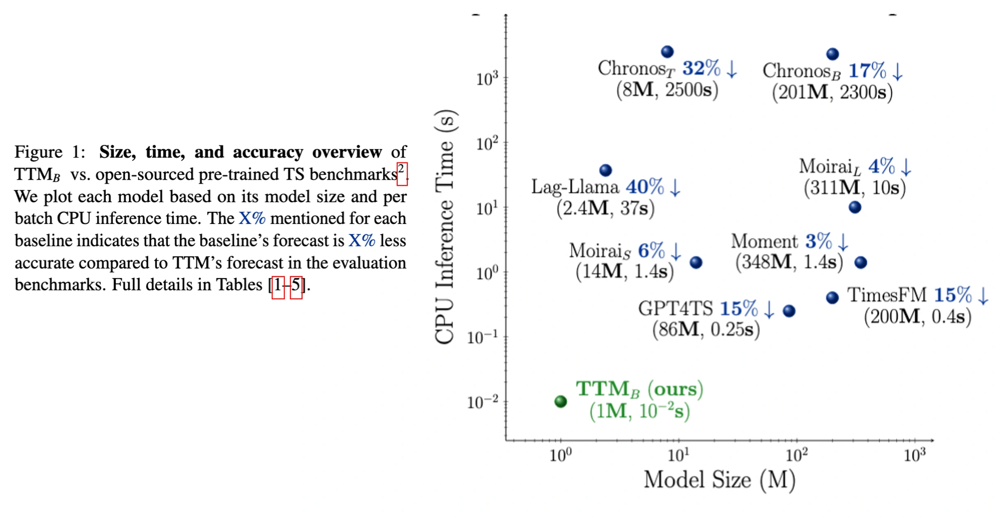

# Granite-TimeSeries-TTM-R1 Model Card

<p align="center" width="100%">

</p>

TinyTimeMixers (TTMs) are compact pre-trained models for Multivariate Time-Series Forecasting, open-sourced by IBM Research. 
**With less than 1 Million parameters, TTM (accepted in NeurIPS 24) introduces the notion of the first-ever “tiny” pre-trained models for Time-Series Forecasting.** 


TTM outperforms several popular benchmarks demanding billions of parameters in zero-shot and few-shot forecasting. TTMs are lightweight 
forecasters, pre-trained on publicly available time series data with various augmentations. TTM provides state-of-the-art zero-shot forecasts and can easily be 
fine-tuned for multi-variate forecasts with just 5% of the training data to be competitive.  Refer to our [paper](https://arxiv.org/pdf/2401.03955.pdf) for more details.


**The current open-source version supports point forecasting use-cases specifically ranging from minutely to hourly resolutions 
(Ex. 10 min, 15 min, 1 hour.).**

**Note that zeroshot, fine-tuning and inference tasks using TTM can easily be executed in 1 GPU machine or in laptops too!!**


**New updates:** TTM-R1 comprises TTM variants pre-trained on 250M public training samples. We have another set of TTM models released recently under TTM-R2 trained on a much larger pretraining
dataset (~700M samples) which can be accessed from [here](https://huggingface.co/ibm-granite/granite-timeseries-ttm-r2). In general, TTM-R2 models perform better than 
TTM-R1 models as they are trained on larger pretraining dataset. However, the choice of R1 vs R2 depends on your target data distribution. Hence requesting users to 
try both R1 and R2 variants and pick the best for your data.


## Model Description

TTM falls under the category of “focused pre-trained models”, wherein each pre-trained TTM is tailored for a particular forecasting 
setting (governed by the context length and forecast length). Instead of building one massive model supporting all forecasting settings, 
we opt for the approach of constructing smaller pre-trained models, each focusing on a specific forecasting setting, thereby 
yielding more accurate results. Furthermore, this approach ensures that our models remain extremely small and exceptionally fast, 
facilitating easy deployment without demanding a ton of resources. 

Hence, in this model card, we plan to release several pre-trained 
TTMs that can cater to many common forecasting settings in practice. Additionally, we have released our source code along with 
our pretraining scripts that users can utilize to pretrain models on their own. Pretraining TTMs is very easy and fast, taking 
only 3-6 hours using 6 A100 GPUs, as opposed to several days or weeks in traditional approaches.

Each pre-trained model will be released in a different branch name in this model card. Kindly access the required model using our 
getting started [notebook](https://github.com/IBM/tsfm/blob/main/notebooks/hfdemo/ttm_getting_started.ipynb) mentioning the branch name.


## Model Releases (along with the branch name where the models are stored):


- **512-96:** Given the last 512 time-points (i.e. context length), this model can forecast up to next 96 time-points (i.e. forecast length)
  in future. This model is targeted towards a forecasting setting of context length 512 and forecast length 96 and
  recommended for hourly and minutely resolutions (Ex. 10 min, 15 min, 1 hour, etc). This model refers to the TTM-Q variant used in the paper. (branch name: main) [[Benchmark Scripts]](https://github.com/ibm-granite/granite-tsfm/blob/main/notebooks/hfdemo/tinytimemixer/ttm-r1_benchmarking_512_96.ipynb)

- **1024-96:** Given the last 1024 time-points (i.e. context length), this model can forecast up to next 96 time-points (i.e. forecast length)
  in future. This model is targeted towards a long forecasting setting of context length 1024 and forecast length 96 and
  recommended for hourly and minutely resolutions (Ex. 10 min, 15 min, 1 hour, etc). (branch name: 1024-96-v1) [[Benchmark Scripts]](https://github.com/ibm-granite/granite-tsfm/blob/main/notebooks/hfdemo/tinytimemixer/ttm-r1_benchmarking_1024_96.ipynb)

We can also use the [[get_model]](https://github.com/ibm-granite/granite-tsfm/blob/main/tsfm_public/toolkit/get_model.py) utility to automatically select the required model based on your input context length and forecast length requirement.
For more variants (till forecast length 720), refer to our new model card [here](https://huggingface.co/ibm-granite/granite-timeseries-ttm-r2)

    

## Model Capabilities with example scripts

The below model scripts can be used for any of the above TTM models. Please update the HF model URL and branch name in the `from_pretrained` call appropriately to pick the model of your choice.

- Getting Started [[colab]](https://colab.research.google.com/github/ibm-granite/granite-tsfm/blob/main/notebooks/hfdemo/ttm_getting_started.ipynb) 
- Zeroshot Multivariate Forecasting [[Example]](https://github.com/ibm-granite/granite-tsfm/blob/main/notebooks/hfdemo/ttm_getting_started.ipynb)
- Finetuned Multivariate Forecasting:
  - Channel-Independent Finetuning [[Example 1]](https://github.com/ibm-granite/granite-tsfm/blob/main/notebooks/hfdemo/ttm_getting_started.ipynb) [[Example 2]](https://github.com/ibm-granite/granite-tsfm/blob/main/notebooks/hfdemo/tinytimemixer/ttm_m4_hourly.ipynb)
  - Channel-Mix Finetuning [[Example]](https://github.com/ibm-granite/granite-tsfm/blob/main/notebooks/tutorial/ttm_channel_mix_finetuning.ipynb)
- **New Releases (extended features released on October 2024)**
  - Finetuning and Forecasting with Exogenous/Control Variables [[Example]](https://github.com/ibm-granite/granite-tsfm/blob/main/notebooks/tutorial/ttm_with_exog_tutorial.ipynb)
  - Finetuning and Forecasting with static categorical features [Example: To be added soon]
  - Rolling Forecasts - Extend forecast lengths beyond 96 via rolling capability [[Example]](https://github.com/ibm-granite/granite-tsfm/blob/main/notebooks/hfdemo/ttm_rolling_prediction_getting_started.ipynb)
  - Helper scripts for optimal Learning Rate suggestions for Finetuning [[Example]](https://github.com/ibm-granite/granite-tsfm/blob/main/notebooks/tutorial/ttm_with_exog_tutorial.ipynb)
 
## Benchmarks

TTM outperforms popular benchmarks such as TimesFM, Moirai, Chronos, Lag-Llama, Moment, GPT4TS, TimeLLM, LLMTime in zero/fewshot forecasting while reducing computational requirements significantly. 
Moreover, TTMs are lightweight and can be executed even on CPU-only machines, enhancing usability and fostering wider
adoption in resource-constrained environments. For more details, refer to our [paper](https://arxiv.org/pdf/2401.03955.pdf) TTM-Q referred in the paper maps to the `512-96` model
uploaded in the main branch. For other variants (TTM-B, TTM-E and TTM-A) please refer [here](https://huggingface.co/ibm-granite/granite-timeseries-ttm-r2). For more details, refer to the paper.


<p align="center" width="100%">

</p>

## Recommended Use
1. Users have to externally standard scale their data independently for every channel before feeding it to the model (Refer to [TSP](https://github.com/IBM/tsfm/blob/main/tsfm_public/toolkit/time_series_preprocessor.py), our data processing utility for data scaling.)
2. The current open-source version supports only minutely and hourly resolutions(Ex. 10 min, 15 min, 1 hour.). Other lower resolutions (say weekly, or monthly) are currently not supported in this version, as the model needs a minimum context length of 512 or 1024.
3. Enabling any upsampling or prepending zeros to virtually increase the context length for shorter-length datasets is not recommended and will
   impact the model performance. 


## Model Details

For more details on TTM architecture and benchmarks, refer to our [paper](https://arxiv.org/pdf/2401.03955.pdf).

TTM-1 currently supports 2 modes:

 - **Zeroshot forecasting**: Directly apply the pre-trained model on your target data to get an initial forecast (with no training).

 - **Finetuned forecasting**: Finetune the pre-trained model with a subset of your target data to further improve the forecast.

**Since, TTM models are extremely small and fast, it is practically very easy to finetune the model with your available target data in few minutes 
to get more accurate forecasts.**

The current release supports multivariate forecasting via both channel independence and channel-mixing approaches. 
Decoder Channel-Mixing can be enabled during fine-tuning for capturing strong channel-correlation patterns across 
time-series variates, a critical capability lacking in existing counterparts.

In addition, TTM also supports exogenous infusion and categorical data infusion.


### Model Sources

- **Repository:** https://github.com/ibm-granite/granite-tsfm/tree/main/tsfm_public/models/tinytimemixer
- **Paper:** https://arxiv.org/pdf/2401.03955.pdf


### Blogs and articles on TTM:
-  Refer to our [wiki](https://github.com/ibm-granite/granite-tsfm/wiki)

  
## Uses

```
# Load Model from HF Model Hub mentioning the branch name in revision field

model = TinyTimeMixerForPrediction.from_pretrained(
                "https://huggingface.co/ibm/TTM", revision="main"
            ) 

# Do zeroshot
zeroshot_trainer = Trainer(
        model=model,
        args=zeroshot_forecast_args,
        )
    )

zeroshot_output = zeroshot_trainer.evaluate(dset_test)


# Freeze backbone and enable few-shot or finetuning:

# freeze backbone
for param in model.backbone.parameters():
  param.requires_grad = False

finetune_forecast_trainer = Trainer(
        model=model,
        args=finetune_forecast_args,
        train_dataset=dset_train,
        eval_dataset=dset_val,
        callbacks=[early_stopping_callback, tracking_callback],
        optimizers=(optimizer, scheduler),
    )
finetune_forecast_trainer.train()
fewshot_output = finetune_forecast_trainer.evaluate(dset_test)

```


## Training Data

The original r1 TTM models were trained on a collection of datasets from the Monash Time Series Forecasting repository. The datasets used include:
 - Australian Electricity Demand: https://zenodo.org/records/4659727 
 - Australian Weather: https://zenodo.org/records/4654822 
 - Bitcoin dataset: https://zenodo.org/records/5122101 
 - KDD Cup 2018 dataset: https://zenodo.org/records/4656756 
 - London Smart Meters: https://zenodo.org/records/4656091 
 - Saugeen River Flow: https://zenodo.org/records/4656058
 - Solar Power: https://zenodo.org/records/4656027 
 - Sunspots: https://zenodo.org/records/4654722
 - Solar: https://zenodo.org/records/4656144 
 - US Births: https://zenodo.org/records/4656049 
 - Wind Farms Production data: https://zenodo.org/records/4654858 
 - Wind Power: https://zenodo.org/records/4656032


## Citation
Kindly cite the following paper, if you intend to use our model or its associated architectures/approaches in your 
work

**BibTeX:**

```
@inproceedings{ekambaram2024tinytimemixersttms,
      title={Tiny Time Mixers (TTMs): Fast Pre-trained Models for Enhanced Zero/Few-Shot Forecasting of Multivariate Time Series},
      author={Vijay Ekambaram and Arindam Jati and Pankaj Dayama and Sumanta Mukherjee and Nam H. Nguyen and Wesley M. Gifford and Chandra Reddy and Jayant Kalagnanam},
      booktitle={Advances in Neural Information Processing Systems (NeurIPS 2024)},
      year={2024},
}
```

## Model Card Authors

Vijay Ekambaram, Arindam Jati, Pankaj Dayama, Wesley M. Gifford, Sumanta Mukherjee, Chandra Reddy and Jayant Kalagnanam


## IBM Public Repository Disclosure: 

All content in this repository including code has been provided by IBM under the associated 
open source software license and IBM is under no obligation to provide enhancements, 
updates, or support. IBM developers produced this code as an 
open source project (not as an IBM product), and IBM makes no assertions as to 
the level of quality nor security, and will not be maintaining this code going forward.